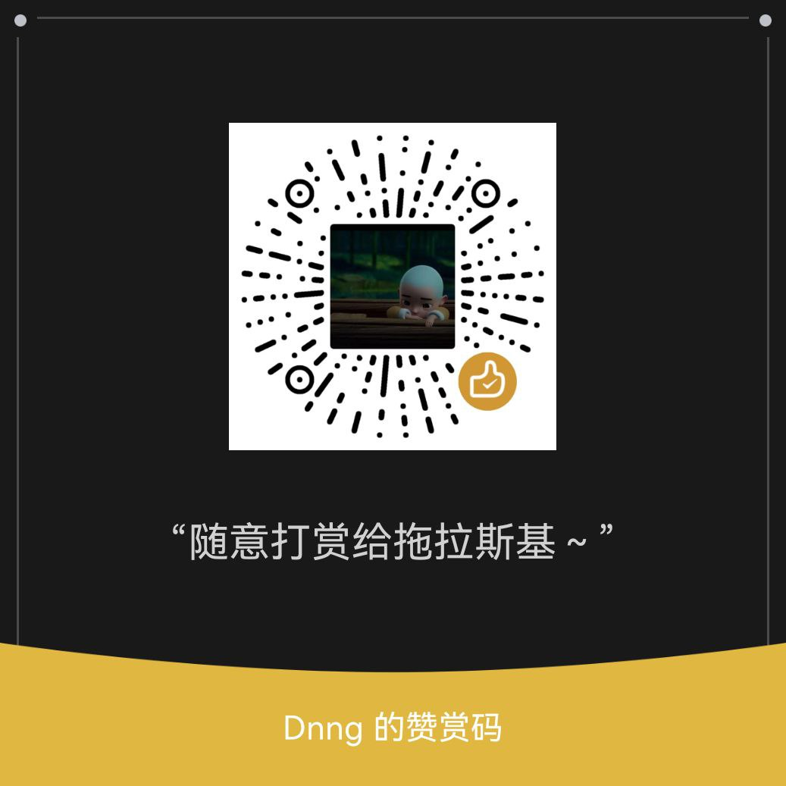

# Nomal
脚本仅供参考，请在24小时内删除本项目<br>
自用
<br><br>
## 拉库命令<br>
```Bash
ql repo https://ghproxy.com/https://github.com/SnowTlsj/Nomal.git "jd_|a_|jdCookie.js" "" "^jd[^_]|USER|function|BBK|utils|MR_util|sendNotify"
```

## 所需依赖-js
```Bash
png-js
date-fns
axios@v0.27.2
dotenv
got
crypto-js
md5
ts-md5
tslib
@types/node
request
tough-cookie
jsdom
download
tunnel
ws
js-base64
qrcode-terminal
moment
ds
```
## 所需依赖-py
```Bash
requests
canvas
ping3
jieba
redis
bs4
depend
```
## 所需依赖-linux
```
python-dev
libssl-dev
libffi-dev
libsas12-dev
build-essential
add apk gcc --no-cache python3-dev libc-dev Cryptodome
```
### 赞赏设置

